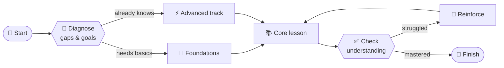

<div align="center">

# Edukors Graph

### Courses that branch, adapt and meet every student where they are.

An open standard and the tools around it for building **learning graphs**: courses described as **nodes** (what the student sees) and **edges** (where they go next).




<sub>One JSON file. Infinite paths. <b>The course adapts to the student — not the other way around.</b></sub>
</div>


---

# **Notices**

1. This repository is still being tested. Changes are expected, with no guarantee of backward compatibility. Use it for experimental purposes only.
2. Edukors Graph is part of a larger project, [Edukors.org](https://edukors.org), a global and free teacher-training school for the use of artificial intelligence in education.

# **About**

## **What problem does Edukors Graph solve?**

It makes adaptive, personalized learning accessible to every educator.

## **Why does adaptive, personalized learning matter?**

Adaptive learning is an old promise in education: give each student what they need, taking into account what they already know, letting them advance at their own pace and correcting mistakes the moment they happen. Apart from isolated initiatives, that promise has never been fulfilled at scale, mainly because the subject has been treated as a technological challenge rather than as a pedagogical approach.

## **What other benefits does Edukors Graph add?**

Combined with predefined instructions (for example, AI assistant "skills"), Edukors Graph makes it possible to create courses that incorporate methodologies such as project-based learning, which increases student engagement with the course. Edukors Graph also makes it possible to generate self-contained files, so that a course can be taken with no internet connection ("unplugged"). Prewritten content, quizzes, forms and branching work fully offline.

## **Is Edukors Graph an app?**

No. Edukors Graph is a standard, as SCORM and LTI are. It is a set of specifications to be read by computer systems, both to generate adaptive courses and to present them to students.

## **How does Edukors Graph deliver these benefits?**

Systems built on Edukors Graph can create learning paths in the form of a graph, with many branches that adapt to each student's context, instead of the same linear path for everyone. With AI, teachers with no technical background can build complex courses that deliver personalized learning. Another benefit is portability: because there is a standard, a course can easily be moved from one platform to another.

## **What is a graph, and why does it matter?**

A graph is a way of representing data, made of nodes and edges arranged in a mesh. Many applications use graphs. Car navigation systems use graphs in which intersections are the nodes and streets are the edges. In social networks, people are the nodes and their relationships are the edges. In streaming platforms, films and people are the nodes and preferences are the edges. Edukors Graph is a standard for building "learning graphs", in which the nodes are activities (texts, videos, exercises, assignments and so on) and the edges are the relations between them, determining their sequence and their branches.

## **How is Edukors Graph different from a "knowledge graph"?**

Edukors Graph is not a knowledge graph; it is a learning graph. The main difference is that a knowledge graph only organizes the hierarchy of knowledge: it is not "playable", it cannot be executed by a learning system. A learning graph organizes the hierarchy of activities the students will carry out, so it is playable. A learning graph may even use a knowledge graph as the initial input for its design, but its focus is what the student will do throughout the course.

## **What is the difference between "adaptive" and "personalized"?**

The original concept of an adaptive course is to determine the flow, or sequence, for each student. The content itself, however, is static, produced in advance. Today many authoring systems already use AI to produce courses, adaptive ones included. But the market standard is AI at authoring time and static content at runtime. Edukors Graph introduces the concept of **dynamic nodes**: at the teacher's discretion, some nodes generate their content in real time, from information collected from the student during their interaction with the course.

## **How does Edukors Graph relate to artificial intelligence?**

AI tools such as assistants, IDEs and coding harnesses can be used to generate courses under the rules specified by Edukors Graph. For example, teachers can use AI assistants such as ChatGPT, Claude, Gemini, DeepSeek and others to generate courses from the Edukors Graph specifications. Teachers can also use more advanced tools such as Claude Code, Codex, Antigravity, VS Code, Cursor, OpenCode and others. These tools let the teacher decide the quality and the cost of the model (LLM) they want to use, which opens the door to frontier models and the most powerful harnesses for developing courses of a high standard.

## **What is the human role in generating courses with Edukors Graph?**

Generating courses with AI under the premises of Edukors Graph is an iterative process, with the teacher reviewing what is produced, requesting changes and steering the flow of the graph. Moreover, the final product of a course generated with the Edukors Graph specifications is a single JSON file, which allows direct editing, with no AI at all.

## **Are there other initiatives with the same goal?**

There are initiatives that cover parts of the problem, but none solves it completely. Among educational standards, [IMS Simple Sequencing](https://www.imsglobal.org/simplesequencing/index.html), incorporated into [SCORM 2004](https://scorm.com/scorm-explained/), defines conditional sequencing rules, but in complex XML and with no relation to AI. [IMS Learning Design](https://www.imsglobal.org/learningdesign/index.html) was an ambitious proposal to describe pedagogical paths, but its complexity limited adoption in practice. [GIFT](https://gifttutoring.org) (Generalized Intelligent Framework for Tutoring) allows the authoring of adaptive tutors and underlies part of the work of the IEEE P2247 group on [adaptive instructional systems](https://sagroups.ieee.org/ltsc/workgroups/), but it follows the classic model of intelligent tutoring systems, without generative AI. Among authoring tools, [H5P Branching Scenario](https://h5p.org/branching-scenario) allows the creation of branching content, but without recording the student's state or generating content with AI.

Outside education, two families of tools come close to the architecture of Edukors Graph. Interactive-fiction tools such as [Twine](https://twinery.org), [Ink](https://www.inklestudios.com/ink/) and [Yarn](https://yarnspinner.dev) combine a graph, variables and conditions, but have no pedagogical focus. AI workflow description languages, such as the [Open Agent Specification](https://arxiv.org/abs/2510.04173), represent flows in JSON as graphs, with nodes that call language models and nodes for conditional branching, but they have no notion of student, assessment, grade or teaching content. Forms with conditional logic described in JSON, such as those of [SurveyJS](https://surveyjs.io), also share part of this logic, without the purpose of teaching.

The initiative closest to Edukors Graph is EduKG ([edukg.org](https://edukg.org)), a standardization effort conducted within the IEEE under project [P2807.6](https://standards.ieee.org/ieee/2807.6/10884/), "Guide for Architectural Framework and Application of Educational Knowledge Graphs", with the participation of institutions such as Tsinghua, Beijing Normal University, Shanghai Jiao Tong, Squirrel AI, Intel and Lenovo.

## **Why is Edukors Graph different from what already exists?**

Edukors Graph sits at the intersection of two worlds that have so far moved separately: the pedagogical sequencing of educational standards and the workflows built on generative AI. We know of no other open, single-file specification that describes the adaptive course itself, with its nodes, its branching rules, the points where AI generates content, and the student's state.

Some characteristics reinforce this difference. Branching rules have simple, predictable semantics: the first condition that holds decides the path, there is always a default path (the "fallback"), and a missing piece of information never satisfies a condition. The student's state (for example, the score in a quiz or the goal declared in a form) uses a single naming system, valid both in branching conditions and in the instructions sent to the AI. Dynamically generated content is stored, so the student always sees the same result when revisiting a node. Support for multiple languages is native. HTML content, especially the content generated by AI, runs in an isolated environment (a "sandbox"), for safety. Finally, the specifications are described in enough detail for a language model to generate valid courses, which makes authoring possible for teachers with no technical background.

The comparison with EduKG is the one that best delimits this scope, precisely because they are two standards with similar names and different purposes. EduKG is a knowledge-representation standard: it describes the domain, the available resources and the pedagogical rules that apply to them, to be consulted by learning systems. Edukors Graph describes the course itself, the path the student follows, in a single JSON file, readable and editable by a teacher and executable by a player. There are two further, deeper differences. The first is the role of AI: in EduKG it consumes the graph, whereas in Edukors Graph it is also the author of the course and, in dynamic nodes, the generator of content at runtime. The second is the barrier to entry. Building an EduKG presupposes a technical team, an ontology and semantic infrastructure, whereas Edukors Graph was designed so that a single teacher, supported by an AI assistant, can produce a complete course. The two are complementary, and an EduKG can perfectly well serve as input for designing a course in Edukors Graph.

# **Technical overview**

Edukors Graph is a standard and a set of resources for developing and implementing learning graphs.

Developing courses in graph form makes it possible to personalize learning paths, extracting the most value from artificial intelligence to offer students adaptive experiences that adjust to each individual profile, taking into account learning gaps, preferences (pains and desires) and needs for deeper study.

Edukors Graph is built on the following core principles:

- **Free of charge**: the resources made available here can be used by anyone at no cost.
- **Open**: the resources are open, the source code is accessible and community contributions are welcome.
- **Multilingual**: the resources allow courses to be built in any language.
- **Responsible use**: the resources are intended exclusively for education and must be employed with the goal of the sustainable development of society and the planet through education.

The project has four parts. The **schema** is the standard itself. The **builder**, the **player** and the **samples** are the tools and examples around it, and all of them must stay compatible with the schema.

## **Schema**

The centerpiece is the schema ([schema](schema) folder): a [JSON Schema](https://json-schema.org) (draft 2020-12) describing a course as a single JSON file with three parts:

- `info` — metadata: title, author, version, languages, the `start` node and an optional course-wide `system-prompt` for the AI.
- `nodes` — **what** the student sees: content and activities.
- `edges` — **in which order**: directed links between nodes. Because edges can carry conditions, the order is not fixed and the course adapts to each student.

A course file should name the version of the standard it follows. The field is optional, but it lets editors validate the file as it is typed:

```json
"$schema": "https://edukors.org/graph/schema/v1/"
```

There are eight node types. Node ids carry their type as a prefix (`sm1`, `q1`, `e1`, and so on).

| Type             | What it is                                                                          | Stores data? |
| ---------------- | ----------------------------------------------------------------------------------- | :----------: |
| `static-md`    | Markdown written in advance, shown as written.                                      |      No      |
| `static-html`  | HTML built in advance, rendered in a sandbox.                                       |      No      |
| `dynamic-md`   | A prompt the AI runs during the course; the markdown it returns is shown.           |      No      |
| `dynamic-html` | A prompt the AI runs during the course; the HTML it returns is shown, in a sandbox. |      No      |
| `essay`        | The student writes a text and the AI grades it.                                     |     Yes     |
| `quiz`         | A set of multiple-choice questions.                                                 |     Yes     |
| `form`         | A form the student fills in.                                                        |     Yes     |
| `bool`         | A yes/no question, usually asked to choose between two paths.                       |     Yes     |

Activities store what the student produced under keys named `<node-id>.<name>`, such as `q1.percent`, `f1.goal`, `e1.score` or `b1.answer`. Those keys drive the two adaptive mechanisms of the standard. In **edges**, a `when` condition decides the path; edges leaving a node are tried from top to bottom, the first one that holds is taken, and an edge without `when` is the fallback:

```json
"edges": [
  { "from": "q1",  "to": "sm2", "when": { "key": "q1.percent", "operator": "gte", "value": 70 } },
  { "from": "q1",  "to": "sm3" },
  { "from": "sm3", "to": "sm2" }
]
```

In **prompts**, `{{STORAGE: key}}` inserts the stored value, so a dynamic node can write for one particular student: `Write a study plan for a student whose goal is: {{STORAGE: f1.goal}}`.

Every text the student reads is a list of `{ "lang", "text" }` entries, one per language of the course. Markdown accepts inline HTML and LaTeX formulas, which the player typesets with KaTeX.

See the [schema.README](schema/schema.README.md) for the full description of the standard, and the field descriptions inside [schema.json](schema/schema.json) for the exact contract.

## **Builder**

The **builder** is a pair of AI assistant *skills*, each a folder with a `SKILL.md` file (the instructions the model follows) plus the references and scripts it needs. `edukors-graph-builder` owns the format and the generation step — node types, edges, conditions, prompts, the schema, two HTML templates and three scripts. `edukors-graph-editor` owns the folder standard a course is developed in: the course exploded into `info/`, `nodes/<node-id>/` and `edges/`, with every piece of prose as a real `.md`/`.html` file, so it can be read, diffed and edited one node at a time. The author works in those folders, and the builder generates into `_output/`.

Once the skills are installed in an assistant, an IDE or a coding harness, an author asks for "a course about compound interest" and gets back three files:

| File                   | Content                                                                  |
| ---------------------- | ------------------------------------------------------------------------ |
| `<slug>-course.json` | The course, valid against the schema. This is the file a player imports. |
| `<slug>-map.html`    | A standalone viewer that draws the graph, for the author.                |
| `<slug>-player.html` | A standalone preview player that runs the course as a student sees it.   |

The builder collects the brief (size, objectives, sources, course type, static or dynamic content, media, linear or adaptive path), builds a blueprint, writes the course, validates it and builds the two HTML files. It can also edit an existing course, and bring a loose course JSON into the exploded layout. The scripts use only the Python 3 standard library and work without the assistant.

See the [builder.README](builder/builder.README.md) for details.

## **Player**

The **player** is the server that delivers courses to students. It is a reference implementation in plain PHP (8.1 or later, no framework, no Composer dependency) with MySQL. It takes the standalone player the builder ships, unchanged, and adds around it what a real deployment needs:

- **LTI 1.3**: students arrive from Moodle, Canvas or Blackboard, already identified. The integration is one-way, with no grade passback.
- **Inference**: dynamic nodes and essay grading run on the server, through [OpenRouter](https://openrouter.ai), with the server's own key and any model it names. The prompts of a course never reach the browser, and every call is checked against where the student actually is, with an hourly limit per student and a daily limit for the whole server.
- **Progress**: where each student is, what they answered and what the AI wrote for them, stored in MySQL, so any device resumes where the last one stopped.
- **Offline copy**: one self-contained HTML file the student can download and run with no network.
- **Admin**: courses and their versions, students, LMS platforms and a log of AI calls.

This player is only one example of an implementation. Other players may be developed by the community to meet specific needs.

See the [player.README](player/player.README.md) for installation, LMS registration and the design decisions.

## **Samples**

The [samples](samples) folder holds three courses that tell the same story, **Cats of the World**, in three sizes, so the differences between them come from the graph and not from the subject:

| Sample                  | What it shows                                                                                         |
| ----------------------- | ----------------------------------------------------------------------------------------------------- |
| `world-cats-1-mini`   | The smallest valid course: five static nodes in a straight line.                                      |
| `world-cats-2-simple` | A quiz that decides the path, an AI-written reinforcement step and an AI-graded essay.                |
| `world-cats-3-full`   | All eight node types, three languages, a form that routes, student choices and cycles with a way out. |

Each sample comes as the three files the builder produces. See the [samples.README](samples/samples.README.md) for details.

# **Getting started**

**Explore a course.** Open [world-cats-3-full-map.html](samples/world-cats-3-full-map.html) in a browser to see the graph, and [world-cats-3-full-player.html](samples/world-cats-3-full-player.html) to walk it as a student. Both carry the whole course and need no server, though these particular samples fetch their photographs from Wikimedia Commons. Read the three sample JSON files next to the [schema.README](schema/schema.README.md) to learn the standard.

**Build a course with an AI assistant.** Copy both folders under [builder/skills](builder/skills) — [edukors-graph-builder](builder/skills/edukors-graph-builder) and [edukors-graph-editor](builder/skills/edukors-graph-editor) — to wherever your assistant loads skills. In Claude Code that is `.claude/skills/` inside a project, or `~/.claude/skills/` for every project; in claude.ai, upload each folder as a skill in the settings. Then ask for a course. The skills ask only for what is missing from the brief and deliver the three files.

**Validate and build by hand.** The scripts need Python 3 and nothing else:

```bash
python3 builder/skills/edukors-graph-builder/scripts/validate_course.py my-course.json
python3 builder/skills/edukors-graph-builder/scripts/build_viewer.py my-course.json -o my-course-map.html
python3 builder/skills/edukors-graph-builder/scripts/build_player.py my-course.json -o my-course-player.html
```

The validator checks the structure, the graph (dangling edges, fallback order, unreachable nodes, dead ends) and the storage keys, and exits with code `1` on any error.

For a course kept in the exploded layout, one command does all three steps — assemble, validate, build — and a second brings a loose JSON file into that layout:

```bash
python3 builder/skills/edukors-graph-editor/scripts/build_course.py "<Course Title>"
python3 builder/skills/edukors-graph-editor/scripts/split_course.py my-course.json -o "<Course Title>"
```

**Where the preview player's AI steps run.** The standalone player has no API key: it asks the host it runs in for a model. Today that works inside claude.ai chat artifacts and in Artifacts published with the `sample` capability (for example from Claude Code). Opened as a local file, in an IDE preview or in another harness, the AI steps show a retry button and everything else in the course works.

**Deliver a course to students.** Deploy the [player](player) server (PHP 8.1+ with `pdo_mysql`, `curl`, `openssl` and `json`, a MySQL database, an OpenRouter key and HTTPS), import the course JSON and register the server as an LTI 1.3 tool in the LMS. The [player.README](player/player.README.md) walks through every step, including Moodle.

# **Repository layout**

```
edukors_graph/
├─ schema/    the standard: schema.json and its README
├─ builder/   the two authoring skills: edukors-graph-builder and edukors-graph-editor
├─ player/    the reference server: PHP, SQL, admin, LTI
└─ samples/   three courses, each as JSON, map and player
```

Two files exist in more than one place on purpose: `schema/schema.json` is copied verbatim into the builder skill as `assets/course.schema.json`, and that skill's `assets/course_player.html` is copied verbatim into `player/assets/`. When one copy changes, copy it over the other.

# **An ecosystem**

More than a standard or a specification, Edukors Graph can become the basis of a global ecosystem:

- **Authors**: teachers anywhere in the world will be able to produce advanced courses, supported by the skills provided in the builder. The JSON files created are small and very light, easy to port, and can form international catalogues of open courses. Translating a course in the Edukors Graph standard takes a single command in an AI assistant.
- **Providers**: courses created by authors can be hosted by providers, those who have the player developed and deployed on their infrastructure. This allows providers of all kinds: internal or open, commercial or community-run, and so on. Course marketplaces, with different monetization models, may even emerge.
- **Consumers**: learning management systems (LMS) deployed in educational institutions across the planet will be able to consume the courses developed by authors and made available by providers. Some consumers may even integrate the whole cycle, being authors and providers as well.

# **Contributing**

This project is open source and community-driven, contributions of any size are welcome.

Whether you want to fix a typo, report a bug, improve the documentation, suggest a feature, or implement something new, there's a place for you here. You don't need to be an expert, and you don't need permission to get started. Teachers count too: a course that broke, a rule that read badly, a translation that came out wrong. Each of those is worth an issue.

**Ways to help:**

- **Report bugs** — open an [issue](https://github.com/mgarlabx/edukors_graph/issues) describing what happened and how to reproduce it. If a course misbehaved, attach its JSON.
- **Suggest ideas** — start a [discussion](https://github.com/mgarlabx/edukors_graph/discussions) before writing code for larger changes, and always before changing the schema.
- **Write code** — the player is plain PHP, the scripts are plain Python 3, and the viewer and player are single HTML files. Nothing here needs a build step or a dependency.
- **Improve the docs** — clearer documentation is as valuable as a new feature.
- **Review pull requests** — a second pair of eyes always helps.

**Getting started:**

1. Fork the repository and clone it locally.
2. Create a branch for your change: `git checkout -b my-change`.
3. Make your changes and commit them with a clear message.
4. Push the branch and open a pull request describing what you changed and why.

**Before you open a pull request:**

- **Rebuild what you changed.** If you edited a sample's JSON, rebuild its map and player with `build_viewer.py` and `build_player.py`. A stale HTML file is a course that disagrees with itself.
- **Keep the two copies in sync.** `schema/schema.json` is copied verbatim into the `edukors-graph-builder` skill as `assets/course.schema.json`, and that skill's `assets/course_player.html` is copied verbatim into `player/assets/`. Change one and copy it over the other.
- **Treat the schema as the contract.** A change to it also touches both validators (`validate_course.py` and `player/src/validate.php`), the authoring reference and [schema.README](schema/schema.README.md). They move together or not at all.

If anything is unclear or you get stuck, open an issue and ask — questions are contributions too.

# **License**

This project is licensed under the MIT License - see the [LICENSE](LICENSE.md) file for details.

Copyright (c) 2026 Edukors.org - Maurício Garcia
