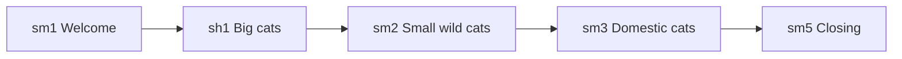
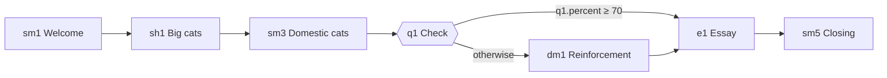
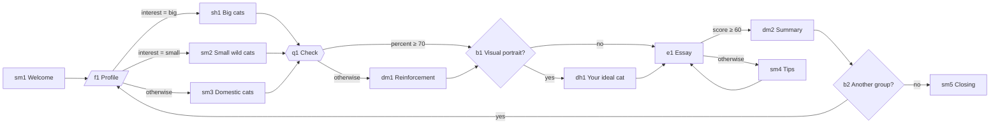

# Samples

*Part of [Edukors Graph](../README.md).*

This folder holds example courses built with the [builder](../builder/builder.README.md) skill. They let you explore the [Edukors Graph Standard](../schema/schema.README.md) in practice, from a plain linear read to a fully adaptive, multilingual course.

All samples tell the same story — **Cats of the World**, a short natural-history course for a general audience — in three sizes. Because the theme stays the same, the differences you see between them come from the graph, not from the subject.

## Files

Each sample is delivered as the three files the builder produces:

| File                   | Content                                                                                      |
| ---------------------- | -------------------------------------------------------------------------------------------- |
| `<slug>-course.json` | The course itself: `info`, `nodes` and `edges`. This is the file imported into Edukors. |
| `<slug>-map.html`    | A standalone viewer that draws the course graph, for the author.                             |
| `<slug>-player.html` | A standalone preview player that runs the course the way a student sees it.                  |

The HTML files carry the course itself, so they open directly in a browser with no server and no build step.

Two things do need a network. The images come from [Wikimedia Commons](https://commons.wikimedia.org) and are referenced by URL — in the JSON and in the built HTML alike — so a sample shown offline keeps its text and loses its photographs. And the dynamic steps and the essay grading need an AI host: they only run when the player is opened inside an AI assistant, published as an Artifact with the `sample` capability, or served by the [player](../player/player.README.md).

## Overview

| Sample                          | Nodes | Edges | Sections | Languages  | Node types                           |     Adaptive     |
| ------------------------------- | :---: | :---: | :------: | ---------- | ------------------------------------ | :--------------: |
| [world-cats-1-mini](#1-mini)     |   5   |   4   |    1    | en         | `static-md`, `static-html`       |        No        |
| [world-cats-2-simple](#2-simple) |   7   |   7   |    2    | en         | +`quiz`, `dynamic-md`, `essay` |    One branch    |
| [world-cats-3-full](#3-full)     |  14  |  19  |    3    | en, pt, zh | all eight types                      | Yes, with cycles |

## 1. Mini

`world-cats-1-mini` — a linear read in five steps: big cats, small wild cats and domestic cats.

What it shows:

- The smallest valid course: `info`, a `start` node and a chain of edges with no conditions.
- Static content only — `static-md` for text and `static-html` for a richer "who is who" page.
- No AI, no stored data: the course runs the same way for every student.

Files: [course](world-cats-1-mini-course.json) · [map](world-cats-1-mini-map.html) · [player](world-cats-1-mini-player.html)

## 2. Simple

`world-cats-2-simple` — a compact, almost linear version with a quiz, adaptive reinforcement and an assessed essay.

What it shows:

- A course-wide `system-prompt` that sets the AI's role for every dynamic step.
- A `quiz` whose result (`q1.percent`) decides the path: students who score 70% or more skip ahead, the others get a `dynamic-md` reinforcement that the AI writes from their own answers (`{{STORAGE: q1.percent}}`, `{{STORAGE: q1.habitat}}` and other quiz keys).
- An `essay` graded by the AI, which stores `e1.text`, `e1.score` and `e1.feedback`.
- Edge order: the conditional edge comes first and the unconditional one works as the fallback.

Files: [course](world-cats-2-simple-course.json) · [map](world-cats-2-simple-map.html) · [player](world-cats-2-simple-player.html)

## 3. Full

`world-cats-3-full` — a short adaptive course where the path changes with the student's interests, results and choices.

What it shows:

- **All eight node types**: `static-md`, `static-html`, `dynamic-md`, `dynamic-html`, `essay`, `quiz`, `form` and `bool`.
- **Multilingual content**: student-facing texts in English, Portuguese and Chinese (`source-language` plus `other-languages`).
- **A form that routes**: `f1.interest` sends the student straight to the group of cats they chose.
- **Personalisation through storage**: dynamic nodes use `{{STORAGE: key}}` to write reinforcement, a visual portrait and a journey summary for each student.
- **Choices by the student**: `bool` nodes turn yes/no answers into forks.
- **Cycles with a way out**: a low essay score leads to tips and back to the essay, and the student may loop back to the profile to explore another group before closing.

Files: [course](world-cats-3-full-course.json) · [map](world-cats-3-full-map.html) · [player](world-cats-3-full-player.html)

## Using the samples

- **To learn the standard**, read the three course files in order, next to the [schema.README](../schema/schema.README.md). Each one adds a layer to the previous.
- **To see a course**, open the `-map.html` file to inspect the graph and the `-player.html` file to walk through it as a student.
- **As a starting point**, ask the builder skill to edit one of them — for instance, "add a quiz after the small wild cats" — instead of starting from an empty file.
- **To test a deployment**, import one of the JSON files into the [player](../player/player.README.md) server.
